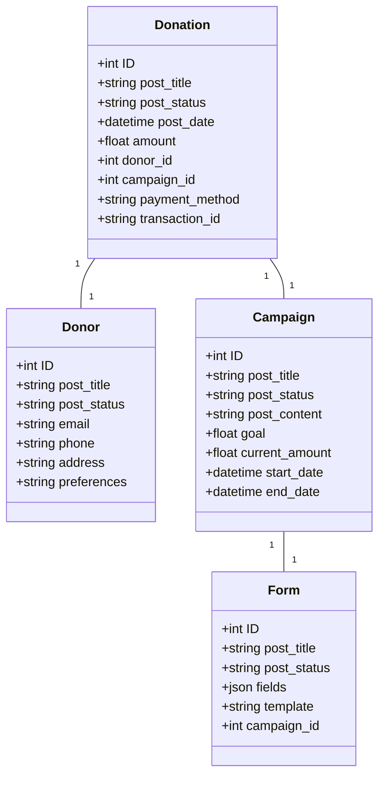

# System Patterns: GiftFlowWp - WordPress Donation Plugin

## Core Architecture

### File Structure
```
giftflowwp/
├── admin/
│   ├── includes/
│   │   ├── post-types/
│   │   │   ├── class-base-post-type.php
│   │   │   ├── class-donation.php
│   │   │   ├── class-donor.php
│   │   │   └── class-campaign.php
│   │   └── meta-boxes/
│   │       ├── class-base-meta-box.php
│   │       ├── class-donation-transaction-meta.php
│   │       ├── class-donor-contact-meta.php
│   │       └── class-campaign-details-meta.php
├── includes/
│   ├── core/
│   │   ├── class-base.php
│   │   └── class-loader.php
│   ├── frontend/
│   │   ├── class-shortcodes.php
│   │   └── class-forms.php
│   └── gateways/
│       ├── class-gateway-base.php
│       ├── class-stripe.php
│       └── class-paypal.php
└── giftflowwp.php
```

### Key Components

1. **Post Types**
   - Base class with common functionality
   - Donation: Private post type for transaction records
   - Donor: Private post type for donor profiles
   - Campaign: Public post type with classic editor support

2. **Meta Boxes**
   - Base class with common functionality
   - Transaction details for donations
   - Contact information for donors
   - Campaign details and settings

3. **Frontend**
   - Shortcodes for embedding forms and content
   - Form handling and validation
   - AJAX processing for donations

4. **Payment Gateways**
   - Abstract base class
   - Extensible architecture for multiple gateways
   - Settings management

## Implementation Patterns

### Post Type Registration
- Uses WordPress register_post_type()
- Custom labels and capabilities
- REST API support where needed
- Classic editor for Campaigns

### Meta Box Implementation
- Uses WordPress add_meta_box()
- Nonce verification for security
- Data sanitization and validation
- Proper saving and retrieval of meta data

### Form Handling
- AJAX-based submission
- Server-side validation
- Secure nonce verification
- Proper error handling

### Payment Processing
- Abstract gateway pattern
- Configurable settings
- Secure transaction handling
- Error handling and logging

## Security Patterns

1. **Data Validation**
   - Input sanitization
   - Nonce verification
   - Capability checks
   - Data type validation

2. **Access Control**
   - Role-based permissions
   - Private post types where appropriate
   - Secure meta box access

3. **Payment Security**
   - Secure gateway integration
   - Proper data handling
   - Transaction verification

## Extension Points

1. **Filters**
   - giftflowwp_payment_gateways
   - giftflowwp_load_files
   - Custom meta box fields

2. **Actions**
   - giftflowwp_settings_gateways
   - giftflowwp_save_settings
   - Custom form processing

## Best Practices

1. **Code Organization**
   - Namespaced classes
   - Clear file structure
   - Proper documentation

2. **WordPress Integration**
   - Follow WordPress coding standards
   - Use WordPress hooks and filters
   - Proper use of WordPress APIs

3. **Performance**
   - Efficient database queries
   - Proper asset loading
   - Caching where appropriate

## Architecture Overview

### 1. Core Components
```
giftflowwp/
├── includes/
│   ├── core/
│   ├── frontend/
│   ├── gateways/
├── admin/
│   ├── css/
│   ├── js/
│   └── partials/
├── assets/
│   ├── css/
│   ├── js/
│   └── partials/
├── languages/
└── giftflowwp.php
```

### 2. Data Model


## Custom Post Types

### 1. Donation Post Type
```php
register_post_type('giftflowwp_donation', [
    'labels' => [
        'name' => __('Donations', 'giftflowwp'),
        'singular_name' => __('Donation', 'giftflowwp'),
    ],
    'public' => false,
    'show_ui' => true,
    'show_in_menu' => true,
    'supports' => ['title', 'custom-fields'],
    'capability_type' => 'post',
    'map_meta_cap' => true,
]);
```

### 2. Donor Post Type
```php
register_post_type('giftflowwp_donor', [
    'labels' => [
        'name' => __('Donors', 'giftflowwp'),
        'singular_name' => __('Donor', 'giftflowwp'),
    ],
    'public' => false,
    'show_ui' => true,
    'show_in_menu' => true,
    'supports' => ['title', 'custom-fields'],
    'capability_type' => 'post',
    'map_meta_cap' => true,
]);
```

### 3. Campaign Post Type
```php
register_post_type('giftflowwp_campaign', [
    'labels' => [
        'name' => __('Campaigns', 'giftflowwp'),
        'singular_name' => __('Campaign', 'giftflowwp'),
    ],
    'public' => true,
    'show_ui' => true,
    'show_in_menu' => true,
    'supports' => ['title', 'editor', 'thumbnail', 'custom-fields'],
    'capability_type' => 'post',
    'map_meta_cap' => true,
]);
```

### 4. Form Post Type
```php
register_post_type('giftflowwp_form', [
    'labels' => [
        'name' => __('Forms', 'giftflowwp'),
        'singular_name' => __('Form', 'giftflowwp'),
    ],
    'public' => false,
    'show_ui' => true,
    'show_in_menu' => true,
    'supports' => ['title', 'custom-fields'],
    'capability_type' => 'post',
    'map_meta_cap' => true,
]);
```

## Meta Fields

### 1. Donation Meta
```php
register_post_meta('giftflowwp_donation', 'amount', [
    'type' => 'number',
    'description' => 'Donation amount',
    'single' => true,
    'show_in_rest' => true,
]);

register_post_meta('giftflowwp_donation', 'donor_id', [
    'type' => 'integer',
    'description' => 'Donor ID',
    'single' => true,
    'show_in_rest' => true,
]);

register_post_meta('giftflowwp_donation', 'campaign_id', [
    'type' => 'integer',
    'description' => 'Campaign ID',
    'single' => true,
    'show_in_rest' => true,
]);

register_post_meta('giftflowwp_donation', 'payment_method', [
    'type' => 'string',
    'description' => 'Payment method',
    'single' => true,
    'show_in_rest' => true,
]);

register_post_meta('giftflowwp_donation', 'transaction_id', [
    'type' => 'string',
    'description' => 'Transaction ID',
    'single' => true,
    'show_in_rest' => true,
]);
```

### 2. Donor Meta
```php
register_post_meta('giftflowwp_donor', 'email', [
    'type' => 'string',
    'description' => 'Donor email',
    'single' => true,
    'show_in_rest' => true,
]);

register_post_meta('giftflowwp_donor', 'phone', [
    'type' => 'string',
    'description' => 'Donor phone',
    'single' => true,
    'show_in_rest' => true,
]);

register_post_meta('giftflowwp_donor', 'address', [
    'type' => 'string',
    'description' => 'Donor address',
    'single' => true,
    'show_in_rest' => true,
]);

register_post_meta('giftflowwp_donor', 'preferences', [
    'type' => 'string',
    'description' => 'Donor preferences',
    'single' => true,
    'show_in_rest' => true,
]);
```

### 3. Campaign Meta
```php
register_post_meta('giftflowwp_campaign', 'goal', [
    'type' => 'number',
    'description' => 'Campaign goal',
    'single' => true,
    'show_in_rest' => true,
]);

register_post_meta('giftflowwp_campaign', 'current_amount', [
    'type' => 'number',
    'description' => 'Current amount raised',
    'single' => true,
    'show_in_rest' => true,
]);

register_post_meta('giftflowwp_campaign', 'start_date', [
    'type' => 'string',
    'description' => 'Campaign start date',
    'single' => true,
    'show_in_rest' => true,
]);

register_post_meta('giftflowwp_campaign', 'end_date', [
    'type' => 'string',
    'description' => 'Campaign end date',
    'single' => true,
    'show_in_rest' => true,
]);
```

### 4. Form Meta
```php
register_post_meta('giftflowwp_form', 'fields', [
    'type' => 'string',
    'description' => 'Form fields',
    'single' => true,
    'show_in_rest' => true,
]);

register_post_meta('giftflowwp_form', 'template', [
    'type' => 'string',
    'description' => 'Form template',
    'single' => true,
    'show_in_rest' => true,
]);

register_post_meta('giftflowwp_form', 'campaign_id', [
    'type' => 'integer',
    'description' => 'Associated campaign ID',
    'single' => true,
    'show_in_rest' => true,
]);
```

## Design Patterns

### 1. Singleton Pattern
- Used for main plugin class
- Ensures single instance of core functionality
- Manages plugin lifecycle

### 2. Factory Pattern
- Used for creating payment gateway instances
- Allows dynamic gateway loading
- Enables third-party gateway integration

### 3. Observer Pattern
- Used for event handling
- Manages donation status changes
- Handles campaign goal achievements

### 4. Strategy Pattern
- Used for payment processing
- Different strategies for different gateways
- Easy addition of new payment methods

### 5. Repository Pattern
- Used for data access
- Abstracts database operations
- Provides consistent data access layer

## Key Technical Decisions

### 1. Database Structure
- Custom tables for core entities
- WordPress meta tables for extensibility
- Proper indexing for performance
- Versioned schema for updates

### 2. Payment Processing
- Direct integration with payment gateways
- No WooCommerce dependency
- Uses official SDKs:
  - Stripe PHP SDK
  - PayPal REST API SDK
- Secure payment processing
- PCI compliant implementation
- Custom payment gateway interface
- Extensible architecture for additional gateways

### 3. Form Building
- JSON-based form definition
- Dynamic field rendering
- Validation rules engine
- Conditional logic processor

### 4. Security
- Nonce verification
- Capability checks
- Data encryption
- Input sanitization
- Output escaping

### 5. Performance
- Caching strategy
- Query optimization
- Asset optimization
- Lazy loading
- Background processing

## Integration Patterns

### 1. WordPress Core
- Custom Post Types
- REST API endpoints
- Admin hooks
- Frontend hooks
- Cron jobs

### 2. External Services
- Payment gateways
- Email services
- Analytics tools
- CRM systems

### 3. Third-party Plugins
- Form builders
- Analytics plugins
- Marketing tools
- Membership systems

## Error Handling

### 1. Logging
- Error levels
- Context information
- Stack traces
- User actions

### 2. Recovery
- Transaction rollback
- State restoration
- User notification
- Admin alerts

### 3. Monitoring
- Performance metrics
- Error rates
- Success rates
- System health

## Testing Strategy

### 1. Unit Testing
- Core functionality
- Payment processing
- Form validation
- Data operations

### 2. Integration Testing
- WordPress integration
- Payment gateway integration
- Third-party plugin integration
- API endpoints

### 3. Performance Testing
- Load testing
- Response times
- Resource usage
- Database performance

## WordPress Class File Naming Conventions

### Critical Naming Patterns
1. **Class File Naming**
   - All class files MUST follow the WordPress naming convention: `class-{name}.php`
   - The filename MUST be lowercase with hyphens
   - Example: `class-plugin.php`, `class-admin.php`, `class-frontend.php`

2. **Autoloader Implementation**
   - The autoloader MUST convert namespace paths to WordPress-style filenames
   - Conversion pattern: `Namespace\Path\ClassName` → `class-class-name.php`
   - Key conversion steps:
     ```php
     // Convert namespace to filename
     $filename = 'class-' . strtolower(str_replace('\\', '-', $relative_class)) . '.php';
     ```

3. **Common Mistakes to Avoid**
   - DO NOT use direct class names as filenames (e.g., `Plugin.php`)
   - DO NOT use camelCase in filenames
   - DO NOT use namespace separators in filenames
   - ALWAYS verify the autoloader path construction

4. **Verification Process**
   - Test autoloader with each new class
   - Verify file paths match WordPress conventions
   - Check case sensitivity in filenames
   - Ensure proper hyphenation of class names 

## Admin Menu Structure

### 1. Main Menu Items
```php
// Main Dashboard Menu
add_menu_page(
    __('GiftFlowWp Dashboard', 'giftflowwp'),
    __('GiftFlowWp', 'giftflowwp'),
    'manage_options',
    'giftflowwp-dashboard',
    [$this, 'render_dashboard_page'],
    'dashicons-heart',
    30
);

// Settings Submenu
add_submenu_page(
    'giftflowwp-dashboard',
    __('Settings', 'giftflowwp'),
    __('Settings', 'giftflowwp'),
    'manage_options',
    'giftflowwp-settings',
    [$this, 'render_settings_page']
);

// Reports Submenu
add_submenu_page(
    'giftflowwp-dashboard',
    __('Reports', 'giftflowwp'),
    __('Reports', 'giftflowwp'),
    'manage_options',
    'giftflowwp-reports',
    [$this, 'render_reports_page']
);
```

### 2. Custom Post Type Menus
```php
// Donations Submenu
add_submenu_page(
    'giftflowwp-dashboard',
    __('Donations', 'giftflowwp'),
    __('Donations', 'giftflowwp'),
    'edit_posts',
    'edit.php?post_type=giftflowwp_donation'
);

// Donors Submenu
add_submenu_page(
    'giftflowwp-dashboard',
    __('Donors', 'giftflowwp'),
    __('Donors', 'giftflowwp'),
    'edit_posts',
    'edit.php?post_type=giftflowwp_donor'
);

// Campaigns Submenu
add_submenu_page(
    'giftflowwp-dashboard',
    __('Campaigns', 'giftflowwp'),
    __('Campaigns', 'giftflowwp'),
    'edit_posts',
    'edit.php?post_type=giftflowwp_campaign'
);

// Forms Submenu
add_submenu_page(
    'giftflowwp-dashboard',
    __('Forms', 'giftflowwp'),
    __('Forms', 'giftflowwp'),
    'edit_posts',
    'edit.php?post_type=giftflowwp_form'
);
```

### 3. Menu Structure
```
GiftFlowWp (Dashboard)
├── Dashboard
├── Donations
├── Donors
├── Campaigns
├── Forms
├── Reports
└── Settings
```

### 4. Capabilities
- Dashboard: `manage_options`
- Settings: `manage_options`
- Reports: `manage_options`
- Donations: `edit_posts`
- Donors: `edit_posts`
- Campaigns: `edit_posts`
- Forms: `edit_posts` 

## Custom Post Types Implementation

### Donations Post Type
- **Purpose**: Store transaction information
- **Fields**:
  - Amount
  - Donor (relationship to Donor post type)
  - Campaign (relationship to Campaign post type)
  - Payment Method
  - Status (Pending, Completed, Failed, Refunded)
  - Transaction ID
  - Date/Time
  - Recurring Interval (if applicable)

### Donors Post Type
- **Purpose**: Store donor profile information
- **Fields**:
  - Name
  - Email
  - Address
  - Phone
  - Donation History (relationship to Donation post type)
  - Communication Preferences
  - Tax Information

### Campaigns Post Type
- **Purpose**: Manage fundraising campaigns
- **Fields**:
  - Title
  - Description
  - Featured Image
  - Financial Goal
  - Start Date
  - End Date
  - Current Progress
  - Status (Active, Completed, Draft)

## Meta Boxes Implementation

### Donation Meta Boxes
1. **Transaction Details**
   - Amount
   - Payment Method
   - Status
   - Transaction ID
   - Date/Time

2. **Recurring Settings**
   - Recurring Interval
   - Next Payment Date
   - Recurring Status

### Donor Meta Boxes
1. **Contact Information**
   - Name
   - Email
   - Phone
   - Address

2. **Donation History**
   - List of related donations
   - Total donated amount
   - Last donation date

3. **Preferences**
   - Communication preferences
   - Tax receipt preferences

### Campaign Meta Boxes
1. **Campaign Details**
   - Financial Goal
   - Start Date
   - End Date
   - Current Progress

2. **Campaign Settings**
   - Status
   - Featured Image
   - Campaign Type

## Implementation Guidelines
1. Use WordPress `register_post_type()` for custom post types
2. Implement meta boxes using `add_meta_box()`
3. Use nonces for security in meta box saving
4. Implement proper sanitization and validation
5. Use appropriate capabilities for access control
6. Maintain data integrity with proper relationships

## Data Relationships
- Donations are linked to Donors (many-to-one)
- Donations are linked to Campaigns (many-to-one)
- Donors have many Donations (one-to-many)
- Campaigns have many Donations (one-to-many) 

## Stripe Payment Gateway Implementation

The GiftFlowWp plugin supports Stripe as a payment gateway. The following sections provide details about the implementation:

### 1. Stripe Integration
- Stripe is integrated as a payment gateway in the plugin.
- The Stripe payment gateway extends the base gateway class.
- Stripe uses the Stripe PHP SDK for payment processing.

### 2. Stripe Configuration
- Stripe settings are managed through the plugin's settings page.
- The plugin uses the Stripe API to process payments.

### 3. Stripe Payment Flow
- When a user fills out a donation form, the plugin sends payment data to Stripe.
- Stripe processes the payment and returns a response.
- The plugin records the transaction and updates the donation status.

### 4. Stripe Error Handling
- The plugin handles Stripe-specific errors and displays appropriate messages to the user.
- Error handling includes logging and notification to the admin.

### 5. Stripe Performance
- The plugin optimizes Stripe integration for performance.
- Stripe API calls are optimized to reduce latency and improve transaction processing.

### 6. Stripe Security
- The plugin ensures secure communication with Stripe.
- Stripe uses HTTPS for all communication.
- The plugin implements proper data encryption and validation.

### 7. Stripe Compliance
- The plugin complies with Stripe's terms of service and PCI compliance requirements.
- The plugin implements secure payment processing practices.

## PayPal Payment Gateway Implementation

The GiftFlowWp plugin supports PayPal as a payment gateway. The following sections provide details about the implementation:

### 1. PayPal Integration
- PayPal is integrated as a payment gateway in the plugin.
- The PayPal payment gateway extends the base gateway class.
- PayPal uses the PayPal REST API for payment processing.

### 2. PayPal Configuration
- PayPal settings are managed through the plugin's settings page.
- The plugin uses the PayPal API to process payments.

### 3. PayPal Payment Flow
- When a user fills out a donation form, the plugin sends payment data to PayPal.
- PayPal processes the payment and returns a response.
- The plugin records the transaction and updates the donation status.

### 4. PayPal Error Handling
- The plugin handles PayPal-specific errors and displays appropriate messages to the user.
- Error handling includes logging and notification to the admin.

### 5. PayPal Performance
- The plugin optimizes PayPal integration for performance.
- PayPal API calls are optimized to reduce latency and improve transaction processing.

### 6. PayPal Security
- The plugin ensures secure communication with PayPal.
- PayPal uses HTTPS for all communication.
- The plugin implements proper data encryption and validation.

### 7. PayPal Compliance
- The plugin complies with PayPal's terms of service and PCI compliance requirements.
- The plugin implements secure payment processing practices.

## Other Payment Gateways

The GiftFlowWp plugin supports other payment gateways. The following sections provide details about the implementation:

### 1. Custom Gateway
- The plugin supports custom payment gateways.
- Custom gateways extend the base gateway class.
- Custom gateways are integrated into the plugin's payment processing flow.

### 2. Custom Gateway Configuration
- Custom gateways are configured through the plugin's settings page.
- The plugin implements proper data handling and validation for custom gateways.

### 3. Custom Gateway Performance
- The plugin optimizes custom gateway integration for performance.
- Custom gateway integration is implemented to reduce latency and improve transaction processing.

### 4. Custom Gateway Security
- The plugin ensures secure communication with custom gateways.
- Custom gateways use HTTPS for all communication.
- The plugin implements proper data encryption and validation for custom gateways.

### 5. Custom Gateway Compliance
- The plugin complies with custom gateway's terms of service and PCI compliance requirements.
- The plugin implements secure payment processing practices for custom gateways.

## Payment Gateway Extension

The GiftFlowWp plugin supports payment gateway extension. The following sections provide details about the implementation:

### 1. Gateway Extension
- The plugin supports payment gateway extension.
- Third-party developers can extend the plugin's payment gateway functionality.

### 2. Gateway Extension Configuration
- Third-party developers can configure payment gateways through the plugin's settings page.
- The plugin implements proper data handling and validation for extended gateways.

### 3. Gateway Extension Performance
- The plugin optimizes extended gateway integration for performance.
- Extended gateway integration is implemented to reduce latency and improve transaction processing.

### 4. Gateway Extension Security
- The plugin ensures secure communication with extended gateways.
- Extended gateways use HTTPS for all communication.
- The plugin implements proper data encryption and validation for extended gateways.

### 5. Gateway Extension Compliance
- The plugin complies with extended gateway's terms of service and PCI compliance requirements.
- The plugin implements secure payment processing practices for extended gateways.

## Payment Gateway Extension

The GiftFlowWp plugin supports payment gateway extension. The following sections provide details about the implementation:

### 1. Gateway Extension
- The plugin supports payment gateway extension.
- Third-party developers can extend the plugin's payment gateway functionality.

### 2. Gateway Extension Configuration
- Third-party developers can configure payment gateways through the plugin's settings page.
- The plugin implements proper data handling and validation for extended gateways.

### 3. Gateway Extension Performance
- The plugin optimizes extended gateway integration for performance.
- Extended gateway integration is implemented to reduce latency and improve transaction processing.

### 4. Gateway Extension Security
- The plugin ensures secure communication with extended gateways.
- Extended gateways use HTTPS for all communication.
- The plugin implements proper data encryption and validation for extended gateways.

### 5. Gateway Extension Compliance
- The plugin complies with extended gateway's terms of service and PCI compliance requirements.
- The plugin implements secure payment processing practices for extended gateways.

## Payment Gateway Extension

The GiftFlowWp plugin supports payment gateway extension. The following sections provide details about the implementation:

### 1. Gateway Extension
- The plugin supports payment gateway extension.
- Third-party developers can extend the plugin's payment gateway functionality.

### 2. Gateway Extension Configuration
- Third-party developers can configure payment gateways through the plugin's settings page.
- The plugin implements proper data handling and validation for extended gateways.

### 3. Gateway Extension Performance
- The plugin optimizes extended gateway integration for performance.
- Extended gateway integration is implemented to reduce latency and improve transaction processing.

### 4. Gateway Extension Security
- The plugin ensures secure communication with extended gateways.
- Extended gateways use HTTPS for all communication.
- The plugin implements proper data encryption and validation for extended gateways.

### 5. Gateway Extension Compliance
- The plugin complies with extended gateway's terms of service and PCI compliance requirements.
- The plugin implements secure payment processing practices for extended gateways. 